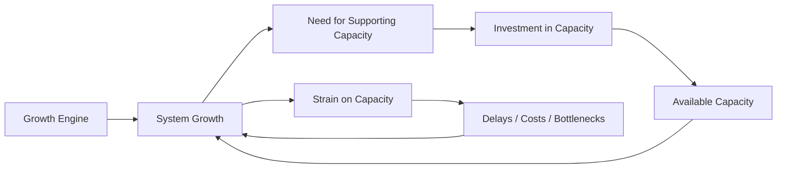
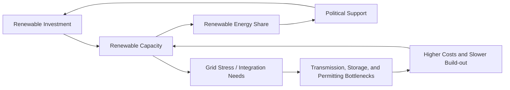

# Milestone 3: Analysis (Path A — Foundational)

## Why Path A Fits This Project

This project is fundamentally a decision-support exercise rather than a purely predictive one. The central question is not only which indicator has changed faster in the past, but which policy priority is more likely to produce a stronger and more manageable system response between 2026 and 2030. Because Milestone 2 already established key feedback loops through the Causal Loop Diagram (CLD), the Foundational path is the strongest fit. It allows the analysis to build directly on the project’s existing strengths: systems thinking, trade-off analysis, and policy relevance.

Milestone 2 showed three important patterns. First, Canada’s renewable energy share increased only modestly over the long run, rising from 22.6% in 1990 to 23.8% in 2021. Second, energy intensity declined much more consistently, from 8.3 MJ/$2021 PPP GDP in 1990 to about 6.0 in 2022. Third, the project’s exploratory analysis suggests that rising renewable share and falling energy intensity are related, but not perfectly, which implies that policy sequencing and implementation capacity matter.

These findings support a systems-focused analysis. The issue is not whether renewables or efficiency matter—they both do. The question is where the federal government can intervene for the greatest near-term leverage while still supporting long-term decarbonization. Path A is therefore appropriate because it helps explain why the system may resist change, where bottlenecks appear, and how different policy priorities could produce different medium-term trajectories.

---

## System Archetype Analysis

### Archetype 1: Growth and Underinvestment

The most visible system archetype in this decision context is **Growth and Underinvestment**. In this structure, growth begins, but the supporting capacity required to sustain it is not expanded quickly enough. Performance then weakens, not because the original strategy is wrong, but because complementary investment lags behind demand.

In Canada’s energy system, the growth process is renewable deployment. More renewable investment increases renewable capacity, which can increase renewable share, lower emissions intensity, and build additional political support for clean electricity. However, this growth loop is constrained by underinvestment in transmission, storage, grid modernization, interprovincial coordination, and permitting capacity. When those enabling systems lag, renewable expansion becomes slower, more expensive, and more politically contested.

This archetype maps closely to the project’s CLD. The reinforcing loop is:

**Renewable Investment -> Renewable Capacity -> Renewable Share -> Political Support -> Renewable Investment**

The balancing constraint is:

**Renewable Capacity -> Grid Stress / Infrastructure Bottlenecks -> System Costs and Delays -> Slower Renewable Expansion**

The pattern is supported by both project evidence and current policy context. The project’s renewable trend shows only modest long-run growth rather than a sharp acceleration. World Bank data show Canada’s renewable energy share rising from 22.6% in 1990 to 23.8% in 2021, an increase of only 1.2 percentage points over three decades. At the same time, the Government of Canada states that the Clean Electricity Regulations are intended to meet growing electricity demand while preserving affordability and reliability, and that they provide a market signal for investment in renewable energy, smart grids, distributed systems, and storage. That policy language strongly implies that generation growth alone is insufficient without enabling infrastructure.

### Generic Archetype Diagram

### Project-Specific Mapping

### Archetype 2: Shifting the Burden

A second, supporting archetype is **Shifting the Burden**. This appears when policy attention focuses too heavily on supply-side clean electricity additions while neglecting deeper demand-side structural change. Expanding renewable supply is visible and politically attractive, but if demand continues to rise quickly, the system must keep building generation and grid infrastructure just to keep up. In that case, efficiency and intensity reduction become the fundamental solution that receives too little attention.

In this project, the “symptomatic solution” is to add cleaner supply to meet rising demand. The “fundamental solution” is to reduce the amount of energy needed per unit of output across buildings, transport, and industry. Milestone 2 supports this reading: energy intensity has declined much more steadily than renewable share has increased. Canada’s energy intensity fell from 8.3 in 1990 to about 6.0 in 2022, while federal sources report that Canada used 25% less energy per dollar of GDP in 2022 than in 2000 and that efficiency improvements prevented a much larger rise in energy use.

This does not mean renewable expansion is unimportant. It means that if efficiency is under-prioritized, the system may become harder and more expensive to decarbonize because the denominator—energy demand—keeps rising.

---

## Scenario Narratives

### Scenario 1: Status Quo (Continue Current Mixed Policy Without Clear Priority)

Under a status quo path, the federal government continues to support both renewables and efficiency, but without concentrating political capital, funding, and implementation discipline on either one. In this scenario, the existing system dynamics remain largely unchanged. The renewable investment loop (R1) keeps operating, but only gradually. Projects continue to move forward, yet grid upgrades, interconnection, storage, and permitting improvements remain uneven across jurisdictions. As a result, the balancing constraints identified in the Growth and Underinvestment archetype continue to slow the pace of structural change.

A simple continuation of the historical data suggests that renewable share may increase only slightly by 2030. Canada’s renewable energy share moved from 22.6% in 1990 to 23.8% in 2021, which is a slow long-run increase. If that historical pace roughly continues, renewable share may remain only around the mid-24% range by 2030 rather than showing a step change. Energy intensity would likely keep declining because the balancing loop around costs and efficiency adoption is already embedded in the system. Since energy intensity fell from 8.3 in 1990 to roughly 6.0 in 2022, a continuation of trend could place it around the mid-5s by 2030.

The main advantage of this scenario is political manageability. It avoids committing too strongly to one pathway and preserves flexibility. The weakness is that it likely underperforms on transformational change. Emissions may decline, but not fast enough to make the federal agenda appear decisive. The main uncertainty is whether external shocks—technology cost declines, provincial policy shifts, or major industrial electrification demand—force faster change even without a stronger federal priority.

### Scenario 2: Intervention A (Prioritize Reducing Energy Intensity)

In this scenario, Minister Hodgson makes energy intensity reduction the primary federal priority for 2026–2030 while still maintaining baseline renewable support. The government concentrates funding and policy coordination on building retrofits, industrial efficiency, appliance and equipment standards, demand-side management, and transport electrification that reduces energy per unit of output. This activates the balancing loop already visible in the project’s CLD: higher energy costs and policy pressure encourage efficiency adoption, which lowers energy intensity and eases downstream system stress.

This pathway has two important system effects. First, it directly lowers the energy required to generate economic activity, which improves affordability and competitiveness. Second, it reduces pressure on the electricity system, making later renewable integration easier. In other words, efficiency does not replace renewable expansion; it improves the conditions under which renewable expansion can succeed. This is why energy intensity functions as a leverage point rather than just another indicator.

A reasonable scenario estimate is that energy intensity could decline faster than its historical trend if federal policy becomes more concentrated. Since Canada used 25% less energy per dollar of GDP in 2022 than in 2000, and since federal reporting notes substantial cost savings from efficiency gains, a stronger national push could plausibly move energy intensity toward roughly 5.0-5.2 by 2030 rather than the mid-5s expected under status quo continuation. Renewable share might still rise more modestly, perhaps into the 24.5-25.5% range, partly because lower demand makes system integration more manageable but does not by itself transform the supply mix.

The risk in this scenario is political visibility. Efficiency gains are often less visible than new generation projects, and rebound effects may offset part of the savings if cheaper energy services lead to greater use. A second risk is fragmented implementation because provinces, utilities, landlords, firms, and households all influence outcomes.

### Scenario 3: Intervention B (Prioritize Expanding Renewable Energy)

In this scenario, the federal government places renewable expansion at the center of the 2026–2030 energy agenda. Policy effort focuses on accelerating wind, solar, transmission support, energy storage, Indigenous participation, and clean electricity investment signals. This activates the project’s reinforcing renewable loop much more aggressively: renewable investment increases renewable capacity, which raises renewable share, builds public confidence, and strengthens political support for further investment.

If complementary infrastructure is built in parallel, this strategy could improve Canada’s medium-term supply mix more visibly than the status quo. The Government of Canada has already framed the Clean Electricity Regulations as a tool for meeting rising electricity demand while preserving affordability and reliability, and as a signal for investment in renewable energy, smart grids, and storage. Under a well-coordinated version of this scenario, renewable share could plausibly rise into the 26-28% range by 2030, clearly above the slow historical trend. This would be the most visible signal of structural transition.

However, this path also faces the strongest bottlenecks. If grid modernization, storage, and permitting do not keep pace, the system archetype shifts back into Growth and Underinvestment. Costs rise, delays accumulate, and opposition can intensify around affordability or reliability concerns. In that case, the policy may create momentum but fail to deliver enough realized system change by 2030. Energy intensity would probably still decline, but more passively—perhaps toward 5.5-5.7—because the policy focus is on cleaner supply rather than systematically reducing end-use demand.

The main uncertainty is implementation capacity. This scenario performs best if federal and provincial coordination is unusually strong. It performs much worse if jurisdictional conflict, transmission constraints, or supply-chain delays dominate the period.

---

## Leverage Point Analysis

The strongest leverage point in this system is **accelerating end-use efficiency and demand-side energy intensity reduction in buildings, industry, and transport**.

This is the most promising leverage point because it improves multiple policy objectives at the same time. It reduces energy demand growth, moderates system costs, improves affordability, supports competitiveness, and lowers emissions pressure. Unlike renewable generation, which depends heavily on long lead-time infrastructure and cross-jurisdictional alignment, many efficiency interventions can begin producing results earlier through standards, retrofits, equipment replacement, and demand-side management. In systems terms, this leverage point weakens the growth pressure loop and strengthens the balancing efficiency loop.

It also improves the conditions for renewable success. Lower demand growth means less new generation and transmission must be built just to maintain reliability. That reduces the likelihood that renewable policy gets trapped in the Growth and Underinvestment archetype. From a sequencing perspective, efficiency is therefore a force multiplier: it delivers direct benefits on its own and raises the probability that later renewable expansion will be faster, cheaper, and less politically fragile.

The main risks are political and organizational rather than conceptual. Efficiency programs are distributed across many actors, which can make accountability diffuse. Results may be less visible to the public than a new wind or solar project. Rebound effects can reduce net savings. There is also a risk that governments treat efficiency as a secondary or “soft” policy area and underinvest in delivery systems. Even so, relative to effort, this remains the highest-impact intervention available for the 2026–2030 window.

---

## Implications for the Decision

The Milestone 3 analysis suggests that both policy options are necessary, but they are not equally strong as the **first-order federal priority** for 2026–2030. Renewable expansion is essential for long-term decarbonization and becomes more powerful when supported by clean electricity regulation, storage, transmission, and political momentum. However, the system evidence in this project indicates that renewable expansion is more exposed to bottlenecks. Its success depends heavily on complementary infrastructure, permitting speed, and intergovernmental coordination.

Energy intensity reduction appears to offer the more reliable near-term leverage point. Historically, Canada’s energy intensity has improved much more steadily than renewable share has increased. Federal and national sources also show that efficiency gains already reduce energy use, cut costs, and improve economic performance. From a systems perspective, prioritizing energy intensity reduction dampens demand pressure, strengthens affordability, and makes later renewable deployment easier rather than harder.

For Minister Hodgson, the implication is not “efficiency instead of renewables.” It is **efficiency first, renewables in parallel, with supply-side acceleration sequenced on top of lower demand growth**. That approach offers the best balance of short-term controllability and long-term transition value. The remaining uncertainties are significant: provincial cooperation, electricity demand growth from electrification, technology costs, hydro conditions, and the strength of rebound effects. These uncertainties mean the recommendation should remain conditional rather than absolute. Still, based on the evidence available in this project, reducing energy intensity should be the primary federal priority for 2026–2030, while renewable expansion should remain the critical parallel investment track.
