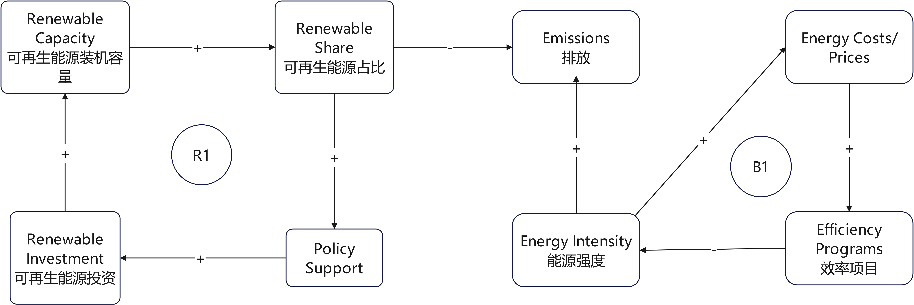

Project Title: 
Canada Energy 2026–2030: Renewables vs Energy Intensity (SDG 7)

Decision Statement: 
Should Tim Hodgson, Canada's Minister of Energy and Natural Resources, prioritize expanding renewable energy (SDG 7.2.1) or reducing energy intensity (SDG 7.3.1) in Canada's 2026–2030 federal energy agenda?

Executive Summary:
Canada’s 2026–2030 energy agenda must balance affordability, reliability, emissions, and long-term competitiveness. Two credible levers are (1) expanding the renewable energy share in total final energy consumption (SDG 7.2.1) and (2) reducing energy intensity (SDG 7.3.1), which measures energy used per unit of economic output. Both options support climate and economic goals, but they compete for limited public funds, grid capacity, and implementation attention.

The choice is not obvious because the impacts show up through a connected system. Expanding renewables can lower emissions, but it can also raise short-run system costs if transmission, storage, and permitting do not keep pace. Reducing energy intensity can lower demand growth and costs, but it requires sustained uptake of efficiency programs across buildings, transport, and industry, and it can be slowed by rebound effects (people use more energy services when they get cheaper).

This project will use SDG indicator data and Canada-focused energy datasets to compare trends, quantify the scale of change needed, and identify where each option has the best leverage. The analysis will connect directly to a practical federal agenda for 2026–2030: what to prioritize first, what to sequence, and what risks to watch.

Initial Causal Loop Diagram

Key feedback loops
- **R1 (Reinforcing):** Renewable investment → renewable capacity → renewable share → policy support → renewable investment.  
  *Idea:* Early wins can build momentum and attract more support and funding.
- **B1 (Balancing):** Energy intensity → energy costs/prices → efficiency programs → energy intensity.  
  *Idea:* Higher costs can trigger efficiency action that pushes intensity back down.