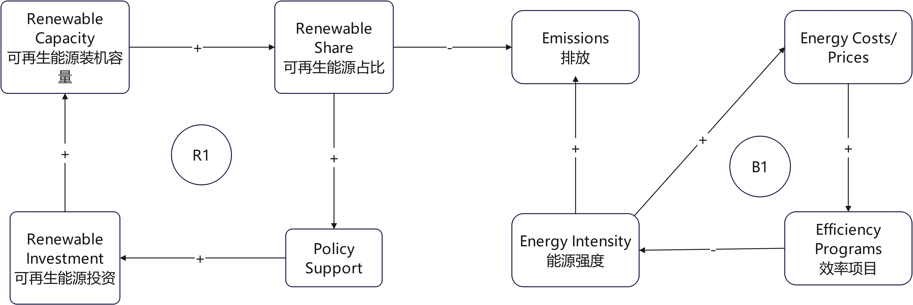

Project Title: 
Canada Energy 2026–2030: Renewables vs Energy Intensity (SDG 7)

Decision Statement: 
Should Tim Hodgson, Canada's Minister of Energy and Natural Resources, prioritize expanding renewable energy (SDG 7.2.1) or reducing energy intensity (SDG 7.3.1) in Canada's 2026–2030 federal energy agenda?

#决策声明：
加拿大能源与自然资源部长蒂姆·霍奇森在制定 2026-2030 年联邦能源议程时，应优先考虑扩大可再生能源（可持续发展目标 7.2.1）还是降低能源强度（可持续发展目标 7.3.1）？

Executive Summary:
Canada’s 2026–2030 energy agenda must balance affordability, reliability, emissions, and long-term competitiveness. Two credible levers are (1) expanding the renewable energy share in total final energy consumption (SDG 7.2.1) and (2) reducing energy intensity (SDG 7.3.1), which measures energy used per unit of economic output. Both options support climate and economic goals, but they compete for limited public funds, grid capacity, and implementation attention.

The choice is not obvious because the impacts show up through a connected system. Expanding renewables can lower emissions, but it can also raise short-run system costs if transmission, storage, and permitting do not keep pace. Reducing energy intensity can lower demand growth and costs, but it requires sustained uptake of efficiency programs across buildings, transport, and industry, and it can be slowed by rebound effects (people use more energy services when they get cheaper).

This project will use SDG indicator data and Canada-focused energy datasets to compare trends, quantify the scale of change needed, and identify where each option has the best leverage. The analysis will connect directly to a practical federal agenda for 2026–2030: what to prioritize first, what to sequence, and what risks to watch.

#执行摘要
加拿大 2026–2030 年的能源议程必须在可负担性、可靠性、排放和长期竞争力之间取得平衡。两个可信的杠杆是（1）扩大可再生能源在最终能源消费中的份额（可持续发展目标 7.2.1）和（2）降低能源强度（可持续发展目标 7.3.1），即每单位经济产出所使用的能源。两种选择都支持气候和经济目标，但它们在有限的公共资金、电网容量和实施关注度上相互竞争。

这一选择并不明显，因为影响通过一个相互关联的系统显现。扩大可再生能源可以降低排放，但如果输电、储能和审批跟不上，也可能提高短期系统成本。降低能源强度可以减少需求增长和成本，但这需要在建筑、交通和工业领域持续采用效率项目，并且可能被回弹效应所减缓（当能源服务变得更便宜时，人们会使用更多）。

该项目将使用可持续发展目标指标数据和以加拿大为重点的能源数据集来比较趋势、量化所需变革的规模，并识别每个选项在哪些方面具有最佳杠杆作用。该分析将直接与 2026–2030 年的实际联邦议程相衔接：首先应优先考虑什么、应如何排序以及应关注哪些风险。

Initial Causal Loop Diagram

Key feedback loops
- **R1 (Reinforcing):** Renewable investment → renewable capacity → renewable share → policy support → renewable investment.  
  *Idea:* Early wins can build momentum and attract more support and funding.
- **B1 (Balancing):** Energy intensity → energy costs/prices → efficiency programs → energy intensity.  
  *Idea:* Higher costs can trigger efficiency action that pushes intensity back down.