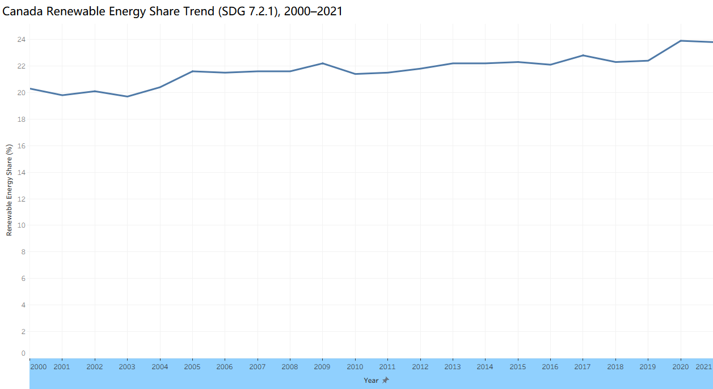
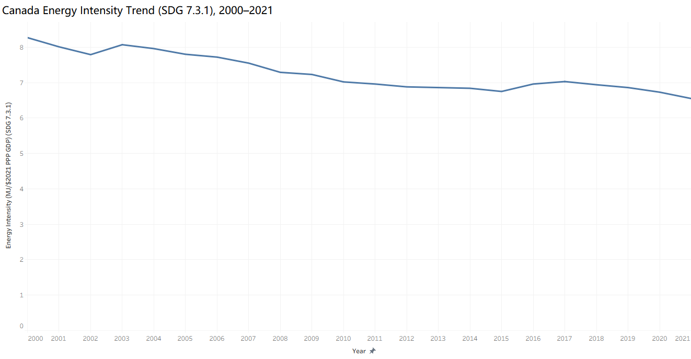
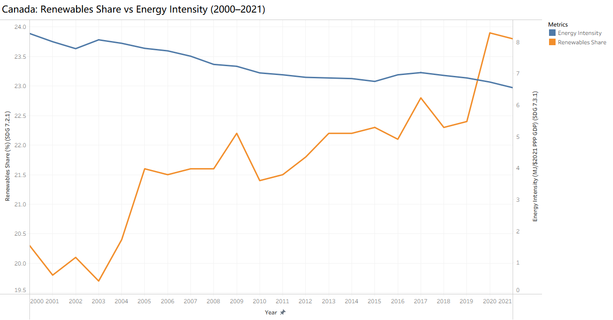
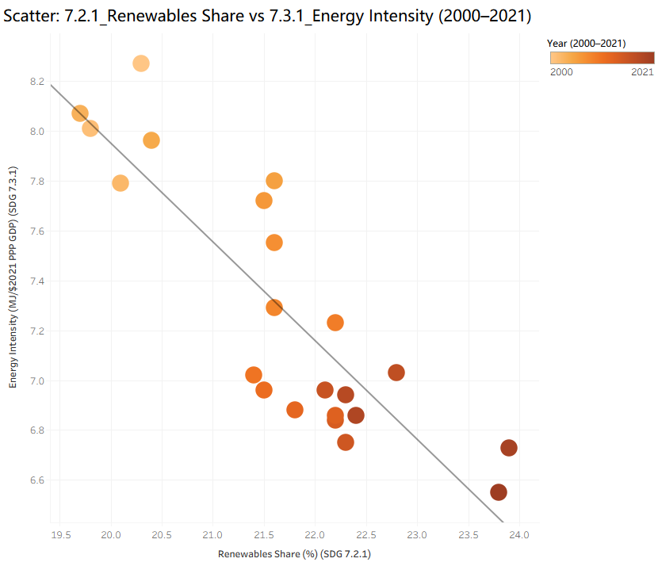
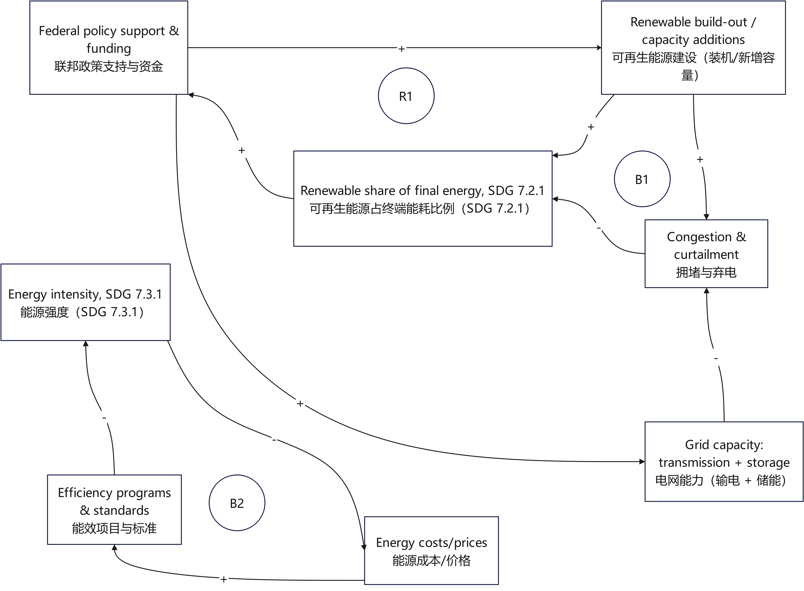

# Canada Energy 2026–2030: Renewables vs Energy Intensity (SDG 7)

## Decision Statement

Should Tim Hodgson, Canada's Minister of Energy and Natural Resources, prioritize expanding renewable energy (SDG 7.2.1) or reducing energy intensity (SDG 7.3.1) in Canada's 2026–2030 federal energy agenda?

---

## Executive Summary

Canada’s 2026–2030 energy agenda must balance four core objectives: affordability, reliability, emissions reduction, and long-term competitiveness. Two policy levers aligned with UN Sustainable Development Goal 7 are under consideration: expanding the renewable share of total final energy consumption (SDG 7.2.1) and reducing energy intensity (SDG 7.3.1), defined as energy use per unit of economic output.

Both strategies contribute to climate goals but operate through different system dynamics. Renewable expansion primarily affects the supply side of the energy system, influencing emissions intensity, infrastructure investment, and grid stability. Energy intensity reduction acts on the demand side, shaping consumption behavior, technological efficiency, and long-term cost structures.

The decision is complex because both options compete for fiscal resources, political capital, and implementation capacity. The objective of this project is to use empirical data and systems thinking to clarify tradeoffs, identify feedback structures, and support an evidence-based federal agenda for 2026–2030.

For full background research and stakeholder analysis, see [Background.md](Background.md).

---

# Milestone 2: Data Exploration & System Mapping

---

## Data Sources

This analysis draws on publicly available datasets from the World Bank SDG database:

1. **SDG 7.2.1 – Renewable Energy Share**  
   Indicator Code: EG.FEC.RNEW.ZS  
   Unit: % of total final energy consumption  
   Country: Canada  

2. **SDG 7.3.1 – Energy Intensity**  
   Indicator Code: EG.EGY.PRIM.PP.KD  
   Unit: MJ per constant 2017 PPP GDP  
   Country: Canada  

The cleaned datasets are stored in the `/data` directory.  
Full documentation is available in `/data/README.md`.

---

## Data Preparation Summary

The raw World Bank data required several cleaning steps:

- Removed missing values for incomplete recent years  
- Standardized year formats  
- Converted wide format to long format (where necessary)  
- Filtered to overlapping years for both indicators  
- Merged datasets using Year as the key  

Full documentation of all cleaning decisions is provided in **Wrangling.md**.

---

## Exploratory Data Analysis (EDA)

### Visualization 1: Renewable Energy Share Trend (1990–2021)

Renewable energy share in Canada has shown gradual but uneven growth over the past three decades. The overall trajectory is upward, but the slope is relatively modest. This suggests that structural expansion of renewables is occurring, but not at an accelerated pace.

For the decision-maker, this indicates that prioritizing renewables may require substantial policy acceleration if ambitious 2030 targets are to be met.

---

### Visualization 2: Energy Intensity Trend (1990–2021)

Energy intensity has shown a steady long-term decline. This indicates that Canada has gradually improved economic energy efficiency, meaning less energy is used per unit of GDP.

This downward trend suggests that energy efficiency policies have historically produced measurable structural change. For the Minister, this indicates that demand-side interventions may produce more predictable system-wide improvements.

---

### Visualization 3: Renewable Share vs Energy Intensity (Relationship)

The scatter plot comparing renewable share and energy intensity suggests an inverse relationship: as renewable share increases, energy intensity tends to decline.

This relationship supports the hypothesis that supply-side decarbonization and demand-side efficiency improvements may reinforce one another. However, the relationship is not perfectly linear, indicating that other economic and policy variables influence system behavior.

---

### Visualization 4: GDP and Energy Use Dynamics

This visualization explores the relationship between economic growth and energy use. While GDP has grown substantially over time, energy intensity has declined, indicating partial decoupling between economic growth and energy consumption.

For decision-making, this is critical: it suggests that economic competitiveness and energy efficiency improvements are not inherently contradictory.

---

# Refined Causal Loop Diagram

---

## Key Feedback Loops

### R1 – Renewable Investment Loop (Reinforcing)

Renewable Investment → Renewable Capacity → Renewable Share → Political Support → Renewable Investment  

This reinforcing loop suggests that early renewable success can generate momentum through public and political feedback mechanisms.

Evidence: The upward time trend in renewable share supports the existence of cumulative capacity expansion effects.

---

### B1 – Energy Cost Efficiency Loop (Balancing)

Energy Intensity → Energy Costs → Efficiency Adoption → Energy Intensity  

As energy intensity increases, costs rise, encouraging efficiency improvements that reduce intensity.

Evidence: The steady decline in energy intensity over time suggests structural adaptation in response to cost and policy pressures.

---

### R2 – Economic Growth Pressure Loop (Reinforcing)

GDP Growth → Energy Demand → Infrastructure Expansion → GDP Growth  

Economic expansion increases energy demand, which requires infrastructure investment, supporting further growth.

This loop explains why energy policy must account for macroeconomic feedback.

---

## Evidence-Supported Causal Links

1. The negative relationship between renewable share and energy intensity is supported by Visualization 3.  
2. The long-term decline in energy intensity (Visualization 2) supports the balancing efficiency loop.  
3. GDP growth alongside declining intensity (Visualization 4) supports decoupling dynamics.

---

## Implications for the Decision

The empirical data suggests that energy intensity reduction has historically produced steady, structural improvements in Canada’s energy system. Renewable expansion, while progressing, has advanced more gradually and may require stronger policy acceleration to significantly alter system dynamics by 2030.

From a systems perspective, energy intensity reduction appears to activate a balancing loop that stabilizes long-term cost and demand pressures. Renewable expansion activates reinforcing investment loops but may be constrained by infrastructure, grid capacity, and permitting bottlenecks.

This evidence suggests that reducing energy intensity may provide a more immediate and controllable leverage point, while renewable expansion remains critical for long-term decarbonization. The strategic question for the Minister is therefore whether to prioritize short-term system stabilization (energy intensity) or long-term structural transformation (renewables).

Further quantitative and systems analysis in Milestone 3 will examine these tradeoffs more deeply.

---

## Repository Structure

- README.md  
- Background.md  
- Wrangling.md  
- data/  
- img/  
- src/  
